  

## Hi there 👋
<!---->
<!--
**bass-bass/bass-bass** is a ✨ _special_ ✨ repository because its `README.md` (this file) appears on your GitHub profile.

Here are some ideas to get you started:

- 🔭 I’m currently working on ...
- 🌱 I’m currently learning ...
- 👯 I’m looking to collaborate on ...
- 🤔 I’m looking for help with ...
- 💬 Ask me about ...
- 📫 How to reach me: ...
- 😄 Pronouns: ...
- ⚡ Fun fact: ...
-->

<!-- modes : theme=light,dark -->
<!-- icons ： https://arc.net/l/quote/zizyykfh -->
## 🌱 Skills

 

## 🏃‍♀️ Activities

 
  
  

